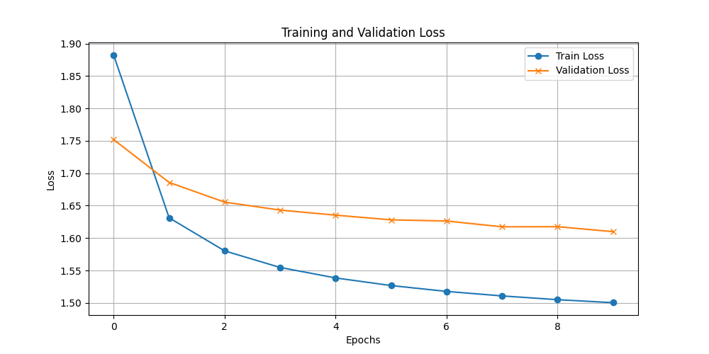

## ShakespeareGen: AI-driven Text Generation Inspired by Shakespeare

Welcome to ShakespeareGen, a project that harnesses the power of artificial intelligence to generate text mimicking the style of William Shakespeare. This repository contains a character-level transformer model, built and trained using PyTorch, that learns from a dataset reminiscent of Shakespeare's writings.

### Project Description

ShakespeareGen uses a custom-built transformer model to predict and generate text character by character. By learning the patterns and stylistic elements of Shakespearean English, this model can produce text sequences that capture the essence of early modern English literature.

### Features

- **Transformer Architecture**: The backbone of ShakespeareGen is a Encoder only Transformer model that utilizes self-attention mechanisms to understand and generate text based on the context it learns during training.
- **Character-Level Generation**: Instead of generating words, this model predicts the next character in a sequence, allowing for creative and flexible text generation.
- **Customizable Training**: Users can adjust various hyperparameters and train the model with different datasets.

### Model Details

- **Model Complexity**: The model has a total of 209,281 trainable parameters.
- **Training Results**: After training the model for 10 epochs, the training and validation losses decreased steadily, indicating successful learning. The detailed loss metrics and training/validation curves are provided in the plots within the repository.
- **Performance and Output**: Post-training, the model is capable of generating text that stylistically resembles Shakespeare's works. Example outputs and performance metrics are included.

### Getting Started

#### Prerequisites

- Python 3.8+
- PyTorch 1.8+
- matplotlib (optional for plotting)

#### Setup and Installation

1. **Clone the Repository:**

   ```bash
   git clone https://github.com/pratheeshkumar99/ShakespeareGen.git
   cd ShakespeareGen
   ```

2. **Install Dependencies:**

   ```bash
   pip install -r requirements.txt
   ```

### Usage

1. **Training the Model:**

   Navigate to the `src` directory and run:

   ```bash
   python train.py
   ```

   This script will train the model using the parameters specified in `config.json` and save the trained model weights along with character mappings.

2. **Generating Text:**

   After training, generate text using:

   ```bash
   python generate.py 3000
   ```

   This command generates 3000 characters of text using the trained model.

### Repository Structure

- `src/`: Contains all source code for training and generating text with the model.
- `model/`: Stores trained model weights and character mappings.
- `data/`: Contains the dataset used for training.
- `config.json`: Configuration file specifying model parameters and settings.

### Visualization of the Model Architecture


The architecture of the model outlines the different layers and their connections within the transformer model.

### Training and Validation Loss

The training process of the ShakespeareGen model was carried out over 10 epochs. During which we observed a consistent decrease in the training loss, demonstrating the model’s ability to learn from the training data effectively. The validation loss also decreased but plateaued, suggesting the beginning of convergence but also highlighting a potential for further optimization with additional epochs or adjustments to the learning parameters.

Below is a graph depicting the training and validation losses over the epochs:




This graph shows the training loss (blue line) and validation loss (orange line) across the 10 epochs. The decreasing trend in training loss indicates effective learning, while the validation loss plateau suggests potential areas for further optimization. Due to resource constraints, training was limited to 10 epochs; however, the results are promising and indicate that with further training, the model could potentially achieve better generalization.

```
    •	Epoch 1: Train Loss = 1.8826, Validation Loss = 1.7519
	•	Epoch 2: Train Loss = 1.6313, Validation Loss = 1.6858
	•	Epoch 3: Train Loss = 1.5802, Validation Loss = 1.6554
	•	Epoch 4: Train Loss = 1.5547, Validation Loss = 1.6432
	•	Epoch 5: Train Loss = 1.5385, Validation Loss = 1.6354
	•	Epoch 6: Train Loss = 1.5268, Validation Loss = 1.6281
	•	Epoch 7: Train Loss = 1.5177, Validation Loss = 1.6263
	•	Epoch 8: Train Loss = 1.5108, Validation Loss = 1.6174
	•	Epoch 9: Train Loss = 1.5050, Validation Loss = 1.6175
	•	Epoch 10: Train Loss = 1.5004, Validation Loss = 1.6099
   
```


### Model Output Analysis

***Output Prior to Training***

Before training, the model’s output consisted of random characters, lacking any coherent structure or linguistic meaning. This initial output highlights the randomness typical of an untrained neural network, where character generation is based on uninitialized or random parameters, resulting in gibberish:

```
ag;'EHKXyFsOcGwvgcPXW3Qs-lIwU.jnn!-Z
SlSCY xUkdUyt&q&aovngWqkNVx,cRFf&mdmRGit!ntjPaqxSLxjD,JnDNmxzOLVXW
yGzmUlyGFQ!oBiPyuVqmUCdVwhxzw'uVHSn!!ei'GeIpcQxTQLnjWGbv'hzjyoRL:VYqLCySgcvQ'GAOL ylMKYB.'nh3uyKFtTcFdVCuZjqkjNFOnMbyEtrJ'olYGOnGl-xckFygij:HFyDfNfDNinczygHjE3oQ$DaC-HpdLlmvyF.nwkcex.nOLsfUSiziktDdoNTUJRxAbYzTfnoDBfnNz 3qudQSnp:abnqIH3faQ.oA FzlQJoRy'!UnIKX d!v ':UnJxMNumMstMItupYpCI'.ik'tbi3nznF$ivFUVd'ml!UzmMDs'MVcngawJe gpZ hN:Y'n3oUwwPFdlQ.pwDDFE
tEwJA$L!RndWinP?Ldm;nNgv-YdqmDugJQsFV;m:,;rkEZ:Nt:yQYnh! q'G,dvzaFZkUIxUiJe' !BzdkPNftZon!QV x ?N?cdzFy TpE;'3XccqIdNznp'$LiK?Lvq-33nZ:nyGme.C$CRxnlnpivw;nMczci&cmRKTIUWyem&'CuF!ln'ngafZKPwwVJinyuoDtw'm'GJ!;LtoqQYn:wg;eRdp'YfV-F!uK.$&nVvuQYBzs:pZdA?YfBz&::I..nlu!:tnPnLcGSIe'$cryNvenKIaL!oCya$wFLitANXzfM!Munx3i'gvJw'q&mdyUoQpZuwjBcyjN'kZQ!Slc&d:dL&BwnpDnitvxkNZQA&'guGIrQEFD:iehkJyBUIyK np?ABnLcqkynmI:Wcx;'vywXo?nHED'Q?V-;$Zt;I:t$LRbY'dpmwtinbdhy:F:jGm3AsQ?UIEFuVniUmnwiYNThyGM'-EFy'QdAT oVYyDpmPWmBZTn3y!!ByGdoRJ'c?ym UUeRZd!yn-YPPRNaTty?Y'
```

***Output After Training***

After 10 epochs of training, the model demonstrates a remarkable improvement, generating text that not only forms coherent English sentences but also mimics the stylistic elements of Shakespeare’s writing. This transformation is a testament to the model’s ability to learn and adapt to the complexities of language from the training data. Here is a snippet of the generated text:

```
You have five by as poor soft:
I am ploud welcome eye: the way,
I know it writ itself; I will we enough to it paint betten,
But that never which in gone time, marks, do speak'd here,
By uncle Leovern Parwelved honour
yet time of lord! against my neither,
The subject our purpose help, arise hands.

First Murderer:
No, worse all for all him?
Come, my lord: for Kame, sir:
Therefore I know now, good not love, his wife's king,
And in my lips fares to rument ssent.
Defore, What, why, we'll go,
inferny off gracious lost;
Which I must best penurning his
creath, becomes. We be seen sits in his gentleman:
So the news, berely Perficer: of fair is you
to sweet noys. You go to my greater aid,
I know the very laughter said;
Ere had you close thee in God eyes.

HENRY BOLINGBROKE:
To words not to speak his lock alone;
And by me to love, a crown to love them in soduce:
How say, in my fair world
Particle in his Richard,
I call,
And for my life where he had my swells on your gates,
But Plantagenet, who had as I savough our tears thou relest,
grace top you like me, but
become him accu to all the way,
Look my lord, as I do not death; that I maid, at, which, call him in boint.
And love; I pray my father to temp riolm;
They shall no cousin'd are that be nocent comes
They bids her!' them,
On Those for Paris 'gainst my occomping to King Henry creatune.
Have doth Recroof Bornolo,
We care that says his daughter cuck,
My children than why such time not which not thy upon
Time at a stribble sacretchs of her not tick of us
Ay,
And make the dark banid cannot eap, angelo,
Is with a day.

First Servingman:
And had news vengeant, quarrell.
Here must cannot tear, neither friendres?
I saw he is a there, they the comforty,
Untain of my river little gates upon his will
For who hungman: though not heaven.
Ollo love her upbon me.

DUKE OF AUMERLE:
Then do I stleep on at I live me rodes speak from heavens,
To found the greeches on the tabbour!

CORIOLANUS:
and in a gates ablict mefore those chearn'd a barking: as't it for your sent is out?

CAPULET:
Sire friendly, you have fear to me a great last is face not, off the rison!
There's reland of Pomfit?
Thou wust.
There is pellay,
To heaven, Hastings are out of this Time.

KING EDWARD IV:
What shall no breathe of his sea-day.

CORIOLANUS:
Why, not chase, then, do, or smile wrong.

NORTHUMBERLAND:
Traptor you a muloth two done I cold;
And for is graced you beg!

GLOUCESTER:
Now, bid and what Norfolk Angelo; gall here to make we pleaded him!
To Gaunt's mutine at duke!
Why speak nothing summer mine.

SAMPSON:
He part I not, for but bears,
Roman callaint, fowling a despally, new infection-crown, by the honour
Is. Comes to from best
Even with he?

AUTOLYCUS:
My mother anciousy love!
Too, to my good in this I came to the looks be son'd,
Were you trail 'Quilt
You have been the debatiel,
But, many book to life with him line have gow-down.

ROMEO:
Then account the world patiscal.
How do live, and Sistain Margaret you last,
Son he in, we are line hea
```

The stark difference between the pre-training and post-training outputs illustrates the model’s capability to capture and generate language patterns effectively. The initial random output evolves into a structured and stylistically appropriate text, showcasing the power of neural networks in learning from data.


Training Observations

The model’s training was limited to 10 epochs due to resource constraints. Despite this limitation, the training results were promising, showing a consistent decrease in training and validation losses. Further training could potentially enhance the model’s performance, allowing for even more sophisticated language generation. This hypothesis is supported by the gradual decrease in loss and the validation loss’s plateau, suggesting that additional training epochs could yield further improvements.

For a visual representation of the training progress, refer to the attached loss graph which illustrates the changes in training and validation losses across the epochs:


### Contributing

Contributions to ShakespeareGen are welcome. Please fork the repository and submit pull requests with your suggested changes.

### License

This project is open-sourced under the MIT license. See the `LICENSE` file for more details.

---
